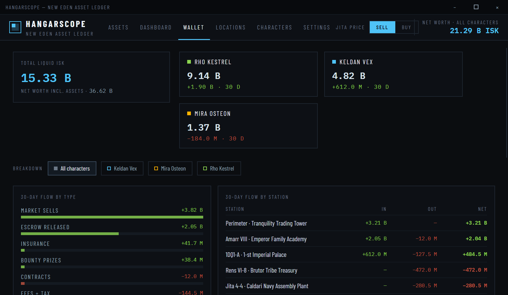
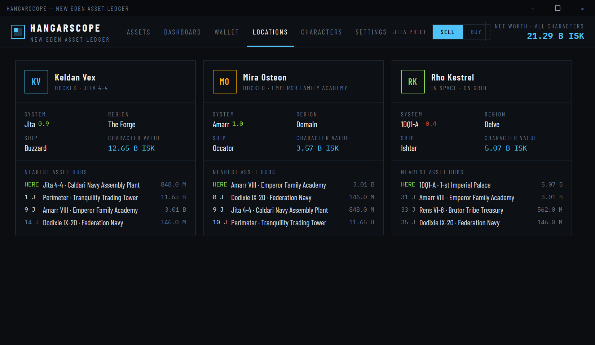
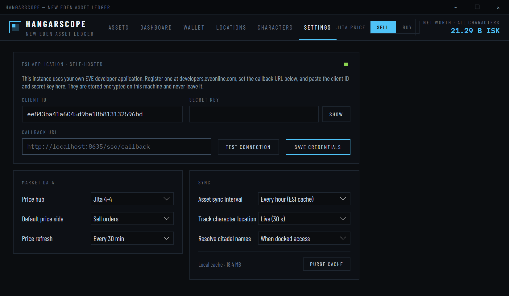

# HANGARSCOPE — Feature Guide

All screenshots show the built-in demo dataset (`HangarScope.exe --demo`). With linked characters every number, station, and jump count comes live from ESI. The code lives in [`HangarScope/`](../HangarScope) — each screen is a view in [`Views/`](../HangarScope/Views) backed by the sectioned recompute engine in [`ViewModels/MainViewModel.cs`](../HangarScope/ViewModels/MainViewModel.cs); all ESI I/O is in [`Services/`](../HangarScope/Services).

## ASSETS — the asset browser

The main ledger: every asset stack across every linked character, aggregated by type + station + ownership flag.

- **Search** matches item name, group, and station text (debounced, precomputed lowercase blobs — fast at thousands of stacks).
- **Characters** — additive multi-select chips, sorted by asset value, with per-character totals. Empty selection = all. Scrolls beyond ~8 characters, header shows the count.
- **Distance from** — jump counts computed from the *closest selected character* or a specific one. Route lengths come from ESI `/route/` and are cached per system pair.
- **Filters** — region, category (Ships/Modules/Minerals/…), ownership (Hangar / Fitted / In container), minimum stack value. All filters AND together.
- **Locations tree** — regions with totals, stations with stack counts; clicking a station toggles it as a filter.
- **Table** — sortable by ITEM / QTY / JUMPS / VALUE. Jump counts are color-coded (green = here, red = >10 jumps). `FITTED` / `CTNR` chips mark non-hangar stacks. Virtualized — real characters with thousands of stacks scroll smoothly.
- **Footer** — filtered stack count and value, plus price-sync provenance (hub + age).
- The `SELL`/`BUY` toggle in the header re-values everything instantly against Jita sell or buy orders.

## DASHBOARD — net worth

- Total net worth (assets, at the chosen price hub and side).
- One card per character — value, stack count, top holding — in a wrap grid sorted by value, built for accounts with many characters.
- Value by region bars (top 12 + aggregated OTHERS).
- Top 10 holdings across all characters with owner and location.

## WALLET

- Total liquid ISK + combined net worth including assets.
- Per-character balance cards with a signed 30-day delta (green/red).
- **Breakdown** chips filter every panel below to one character.
- **30-day flow by type** — signed bars per aggregated ref_type (bounties, market sells/buys, fees + tax, contracts, escrow, insurance, transfers…), with the 30-day net below.
- **30-day flow by station** — IN / OUT / NET per station, sorted by |net|, plus an "in space / no station" line for station-less entries.
- **Recent journal** — date, owner, description, station, ref_type, signed amount. Market transactions are enriched from `/wallet/transactions/` ("Sold Large Skill Injector × 4" instead of a generic label). The journal accumulates locally forever — ESI only serves 30 days back.

## LOCATIONS — character tracker

One card per character:

- Live status (DOCKED · station / IN SPACE · ON GRID), refreshed on the configured cadence (down to 30 s).
- System with security-status coloring (≥0.5 green, >0 amber, ≤0 red — wormholes show −1.0 red), region, current ship, character asset value.
- **Nearest asset hubs** — stations holding assets sorted by jump distance from that character; `HERE` in green at 0 jumps, `—` where no gate route exists.

## CHARACTERS — EVE SSO

- **Authenticate via EVE SSO** launches the OAuth2 authorization-code + PKCE flow in your browser against your own ESI application; the local callback listener captures the code. Repeat once per character — any number of characters can be linked.
- The table shows granted scopes, access-token expiry countdown, and last sync per character, with per-character SYNC and UNLINK actions.
- Refresh tokens are stored DPAPI-encrypted and rotated automatically.

## SETTINGS

- **ESI application** — your client ID and secret key (stored encrypted, never leaving the machine), the fixed callback URL to register at developers.eveonline.com, TEST CONNECTION, and a credentials-verified indicator.
- **Market data** — price hub (Jita 4-4 / Amarr / Dodixie / Rens), default price side, refresh cadence.
- **Sync** — asset sync interval (ESI caches assets 1 h), location tracking cadence, citadel name resolution policy, cache size + PURGE CACHE.

## Under the hood

- **ESI client** — ETag caching, `X-Pages` pagination, error-limit backoff, ≤8 concurrent requests.
- **Asset aggregation** — raw asset items are walked up their container/ship chains to a root station or structure; fitting-slot flags become FITTED, nested items CTNR.
- **Prices** — per-type regional order books; best sell at the hub station, best regional buy.
- **Diagnostics** — sync events log to `%APPDATA%\HangarScope\sync.log`, UI timings to `perf.log`.
- **Demo mode** — `--demo` forces the prototype dataset; `--screen=<assets|dash|wallet|loc|auth|settings>` opens on a given tab (used by screenshot automation).
